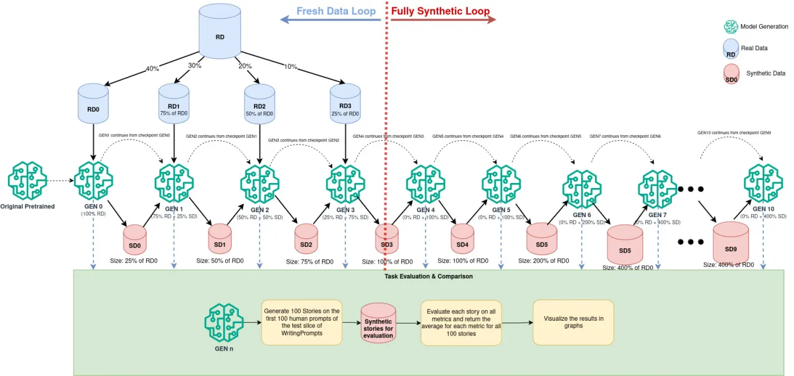

# BA_Thesis_Experiment

## Description

This repository contains the code and resources used for the experiments conducted as part of my Bachelor's Thesis. The primary focus is on fine-tuning of language models for investigating model collpase when training on generation synthetic data, by evaluating the generated text on different diversity metrics. The experiments involve iteratively fine-tuning consequent generations of OPT-125m (Open Pre-trained Transformer) model from Hugging Faces using a custom dataset (WritingPrompts), evaluating each generation on story creation mainly on different diversity metrics.

## Experiment Overview

### Model and Dataset

- **Model**: The model used in the experiment is the OPT (Open Pre-trained Transformer) model provided by Meta AI. The specific version used is `facebook/opt-125m`.
- **Dataset**: The dataset consists of a collection of stories that were pre-processed to remove artifacts such as `<newline>`, `(Edit :)`, and other non-story text. The dataset was further cleaned to ensure high-quality training data.

### Preprocessing

Before training, the dataset undergoes several preprocessing steps:
- Removing special artifacts like `<newline>` and `(Edit :)`.
- Eliminating comments or promotional content that do not belong to the story.
- Normalizing whitespace by replacing multiple spaces with a single space.
- Ensuring proper punctuation by removing spaces before periods.

### Fine-Tuning

The fine-tuning process is conducted using the DeepSpeed library to leverage distributed training capabilities. The following configuration is used:

- **Training Script**: `run_clm.py`
- **Configuration**:
  - `num_train_epochs`: 5
  - `learning_rate`: 5e-5
  - `per_device_train_batch_size`: 4
  - `gradient_accumulation_steps`: 4
  - `save_strategy`: epoch
  - `deepspeed`: `ds_config_AdamW.json`
- **Optimizer**: AdamW with a learning rate of 5e-5, beta parameters (0.9, 0.999), epsilon 1e-8, and weight decay 0.01.
- **Scheduler**: WarmupLR with warmup steps set to 300.

### Generation and Post-processing

After fine-tuning, the model is used to generate stories based on given prompts. The generation parameters are as follows:

- `max_length`: 500 tokens
- `min_length`: 300 tokens
- `temperature`: 0.7
- `top_k`: 50
- `top_p`: 0.9
- `repetition_penalty`: 1.1
- `do_sample`: True

To ensure the generated stories meet the minimum length requirement, an iterative augmentation process is used, where additional tokens are generated until the story reaches the desired length.

### Evaluation Metrics

The syntactic diversity of the generated stories is evaluated using several metrics, including:

- **Distinct-n Metric**: Measures the diversity of n-grams in the generated text.
- **Self-BLEU**: Evaluates the similarity between generated texts to assess diversity.
- **CLIP Score**: Measures the coherence and relevance of the generated text.
- **Universal Dependencies Formalism**: Used to analyze the syntactic structure of the generated text.
- **Weisfeiler-Lehman Graph Kernel**: Maps dependency trees into a vector space for diversity analysis.

### Results and Analysis

The results of the experiment include the evaluation of the generated stories based on the aforementioned metrics. The emergence of skills, such as few-shot learning, zero-shot reasoning, and in-context learning, is analyzed with respect to the size of the training dataset and the model's performance across different tasks.

## How to Use

### Prerequisites

- Python 3.8+
- PyTorch
- Transformers
- DeepSpeed

